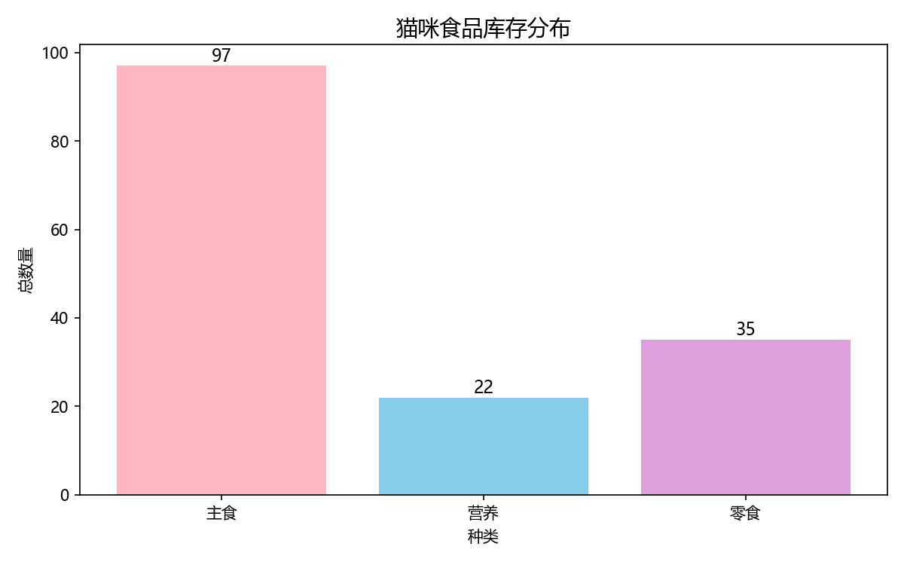
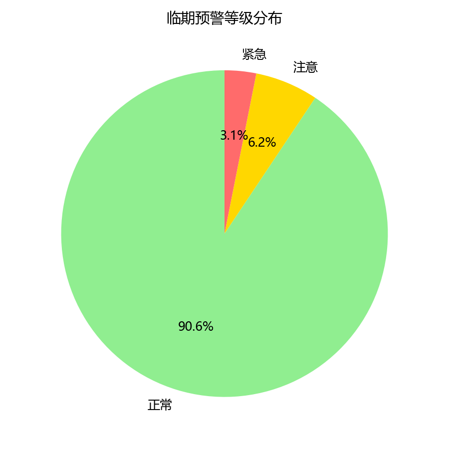

\# 宠物健康数据仓库（Pet Data Warehouse）

\## 项目背景

我家养了一只猫叫夕夕。日常购买的宠物食品种类繁多（主食、零食、营养品），手动管理库存和保质期容易混乱。为解决这个问题，我将数据仓库的分层建模思想应用于个人生活场景，设计并实现了一个从数据采集、清洗到汇总分析的完整 ETL 数据流水线。

\## 数据架构

本项目采用经典数据仓库三层架构：

\- \*\*ODS（原始数据层）\*\*：存储从包装袋手工采集的原始 CSV 数据，保持数据原貌。

\- \*\*DWD（明细数据层）\*\*：对 ODS 数据进行清洗和标准化，包括字段命名规范、格式统一、空值处理。

\- \*\*DWS（汇总数据层）\*\*：基于 DWD 层进行聚合计算，产出库存健康度汇总和临期预警清单，直接支持决策。

\## 技术栈

\- 数据库：MySQL 8.0

\- 数据处理：SQL（ETL 脚本）、Excel（初始数据采集）

\- 数据建模：星型模型 / 数据仓库分层建模

\- 可视化：Excel 图表（待扩展为 Python Matplotlib）

\- AI 工具：用于辅助生成个性化喂养与饮食规划方案

\## 可视化展示

\## 数据表说明

| 表名 | 所属层 | 说明 |

| :--- | :--- | :--- |

| cat\_food\_inventory | ODS | 猫咪食品库存原始数据，含种类、名称、净含量、数量、到期日、推荐喂食量 |

| dwd\_food\_inventory | DWD | 清洗后的库存明细数据，统一字段格式，新增数据加载日期（etl\_date） |

| dws\_inventory\_summary | DWS | 库存健康度汇总表：按种类统计总库存、品种数 |

| dws\_expiration\_alert | DWS | 临期预警清单：标注每种食品的到期日剩余天数和预警等级（紧急/注意/正常） |

\## ETL 流程

1\. \*\*ODS → DWD\*\*：从 `cat\_food\_inventory` 读取原始数据，清洗字段名和格式，插入 `dwd\_food\_inventory`。

2\. \*\*DWD → DWS\*\*：

&nbsp;  - 汇总脚本：按种类 GROUP BY 计算总数量和品种数，插入 `dws\_inventory\_summary`。

&nbsp;  - 预警脚本：用 CASE WHEN 根据到期日划分预警等级（距到期 < 30 天紧急，< 90 天注意，其余正常），插入 `dws\_expiration\_alert`。

\## 项目亮点

\- \*\*真实驱动\*\*：源于个人养猫的实际需求，非虚构项目。

\- \*\*全流程闭环\*\*：完整覆盖数据采集 → 清洗 → 建模 → 汇总 → 预警 → 决策辅助的数据开发全链路。

\- \*\*分层架构实践\*\*：在个人项目中落地 ODS/DWD/DWS 三层数据仓库设计模式。

\- \*\*AI 集成\*\*：将结构化数据对接 AI 工具，探索“数据驱动决策”的实际应用。

\## 项目结构

pet-data-warehouse/

├── ods/

│   └── cat\_food\_inventory.csv          # 原始数据

├── dwd/

│   └── dwd\_create\_tables.sql           # DWD 建表语句

├── dws/

│   └── dws\_create\_tables.sql           # DWS 建表语句

├── etl\_ods\_to\_dwd.sql                  # ETL 脚本：ODS → DWD

├── etl\_dwd\_to\_dws.sql                  # ETL 脚本：DWD → DWS

└── README.md                           # 项目说明文档

\## 后续规划

\- 用 Python / Matplotlib 生成可视化图表

\- 接入真实 IoT 设备数据（智能喂食器）

\- 扩展为移动端小程序，方便日常使用

